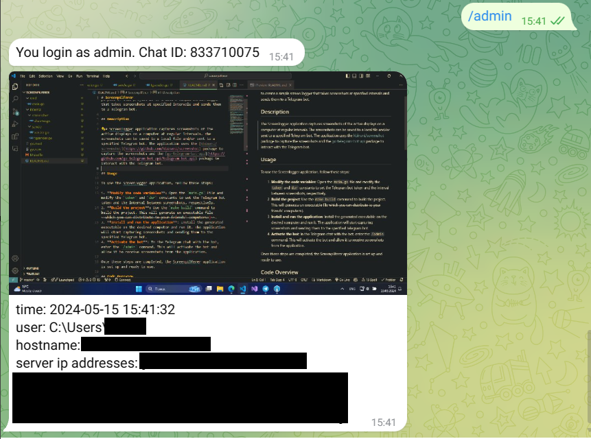

# Screenpilferer

Golang is known as good language for writing ~~malware~~ exotic applications. It is fast, has a small memory footprint, and can be compiled to run on multiple platforms. 
That's why I decided to write a simple screen logger in Go.

This is an educational project for academic interest. The purpose of this project is to create a simple ~~malware~~ screen logger that takes screenshots at specified intervals and sends them to a Telegram bot or any other service.

## Description

The Screenpilferer application captures screenshots of all displays connected to the computer at regular intervals. 

The screenshots can be send to specified Telegram bot and/or saved to a local file. Files are saved in the `C:\Users\User\Pictures\Screenshots` directory by default.

The application uses the [kbinani/screenshot](https://github.com/kbinani/screenshot) package to capture the screenshots and the [go-telegram-bot-api](https://github.com/go-telegram-bot-api/telegram-bot-api) package to interact with the Telegram bot.

## Usage

To use the Screenlogger application, follow these steps:

1. **Modify the code variables**: Open the `main.go` file and modify the `token` and `dur` constants to set the Telegram bot token and the interval between screenshots, respectively.
2. **Build the project**: Use the `make build` command to build the project. This will generate an executable file ~~which you can distribute to your friends' computers:)~~.
3. **Install and run the application**: Install the generated executable on the desired computer and run it. The application will start capturing screenshots and sending them to the specified Telegram bot.
4. **Activate the bot**: In the Telegram chat with the bot, enter the `/admin` command. This will activate the bot and allow it to receive screenshots from the application.

Once these steps are completed, the Screenpilferer application is set up and ready to use.

## Code Overview

The code for the Screenpilferer is organized into two main packages: `screenshot` and `sender`.

### screenshot Package

The `screenshot` package contains the `Shooter` struct, which is responsible for capturing screenshots and sending them to the `sender` package. The `Shooter` struct has the following fields:

* `sdr`: A `sender.Sender` object that is used to send screenshots to the receiver.
* `duration`: The interval between screenshots.
* `shotsDir`: The directory where screenshots are saved (if `saveToFile` is set to `true`).
* `saveToFile`: A boolean value that determines whether screenshots should be saved to a local file.

The `Shooter` struct has a `Start()` method that starts the screenshot capture process. This method uses a ticker to capture screenshots at regular intervals and sends them to the `sender` package.

### sender Package

The `sender` package contains the `Sender` interface and the `TgSender` struct, which implements the `Sender` interface. The `Sender` interface has a single method, `Send()`, which takes a message string and a byte array representing the screenshot image.

The `TgSender` struct has the following fields:

* `bot`: A `tgbotapi.BotAPI` object that is used to interact with the Telegram bot.
* `receiverId`: The ID of the Telegram chat where screenshots should be sent.

The `TgSender` struct has a `Send()` method that sends a screenshot and its metadata to the specified Telegram chat. This method uses the `tgbotapi.FileBytes` struct to send the screenshot image and the `tgbotapi.NewPhotoUpload()` function to create a new photo message. If there is an error sending the message, the method sends an error message to the Telegram chat.

> The `TgSender` struct also has a `getReceiverId()` method that retrieves the ID of the Telegram chat where screenshots should be sent. This method uses the `tgbotapi.GetUpdatesChan()` function to retrieve updates from the Telegram bot and returns the chat ID of the first message that contains the `/admin` command.